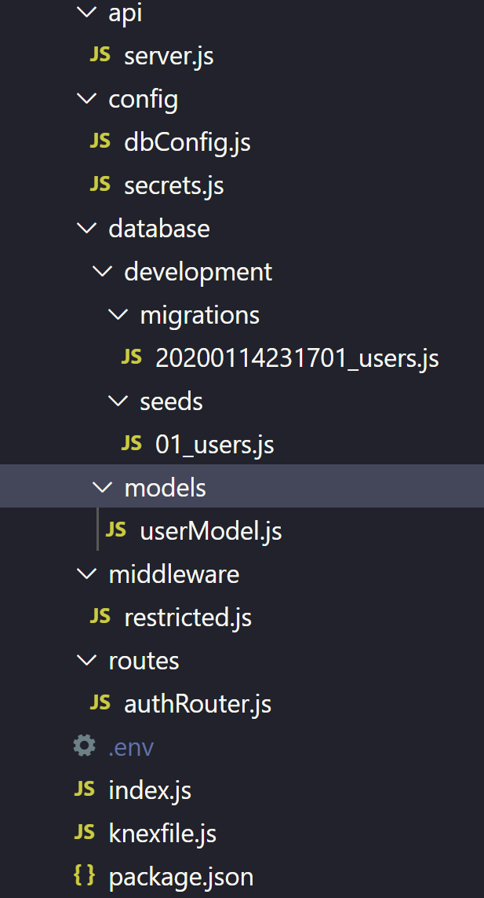

# Bootstrap-backend
ClI to initialize backend projects

## How to
 1.) execute `npx bootstrap-back-end` or `npx @kiamcoo/bootstrap-backend`

 2.) `npm install` and `npm update`

## Template

## Notes
this does not work on macs yet
